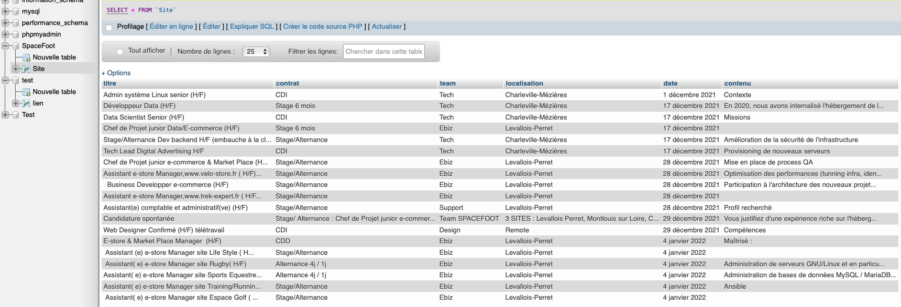

# Scraping SpaceFoot

## Pour effectuer le Scraping, executer les commandes dans cet ordre :
* ``python3 Scraping.py``
* ``python3 getTitre.py``
* ``python3 getTeam.py``
* ``python3 getLocalisation.py``
* ``python3 getDate.py``
* ``python3 getContrat.py``
* ``python3 getContenu.py``
* ``php main.php`` 

Les fichiers pythons vont permettre de récupérer les données du site. Qui vont être stocké dans des fichiers txt.  
Ensuite le fichier php va permettre d'envoyer les données du txt sur une base de donnée phpMyAdmin.  
Le fichier php va aussi créer un fichier csv contenant le nombre d'offres de contrat pour chaque team.  

Voici une image de phpMyAdmin : 

